# Overview

<table>
  <tr>
    <td>
      This is a LoRa APRS Tracker  
      it features an Access Point for real time configuration   
      Its main use is to send a periodic beacon containing: 
      <ul>
        <li>callsign</li>
        <li>GPS or fixed coordinates</li>
        <li>Altitude</li>
        <li>Battery voltage and current</li>
      </ul>
      Any received LoRa APRS packet, <bt/>
      including the one repeated by a local digipeater, 
      is displayed in the (very) small 0.96" display. 
      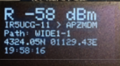
    </td>
    <td>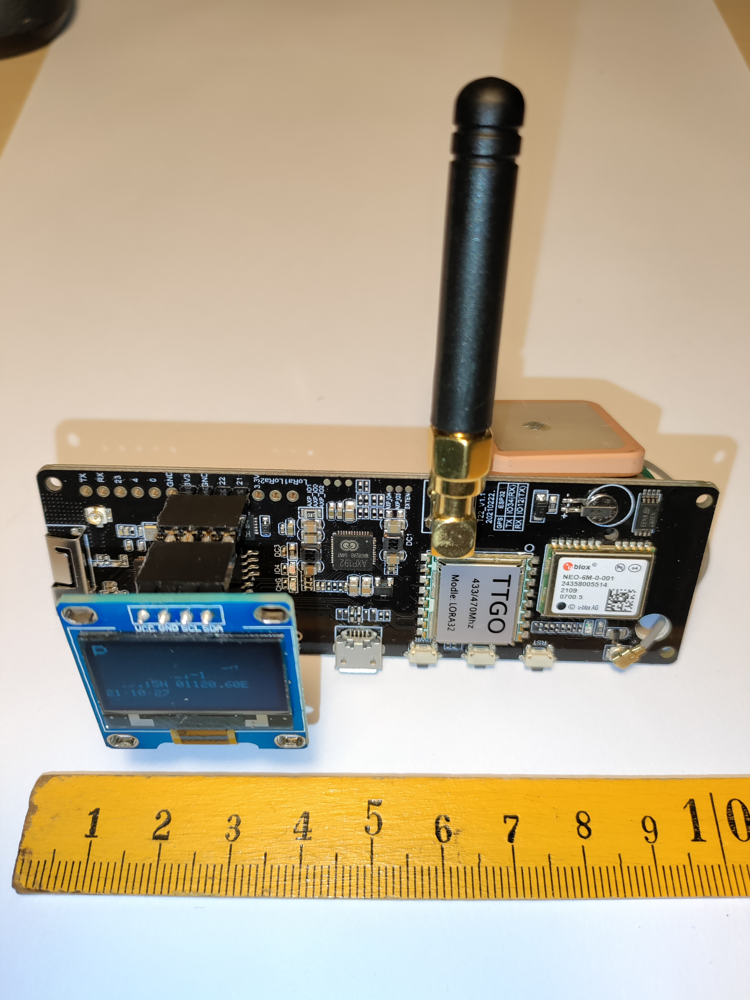</td>
  </tr>
</table>

## About the fork 

This LoRa APRS Tracker is derived from (https://github.com/lora-aprs/LoRa_APRS_Tracker) by [peterus](https://github.com/lora-aprs/LoRa_APRS_Tracker/commits?author=peterus)

I added an Access Point and Captive Portal for easy configuration. 

# Block diagram
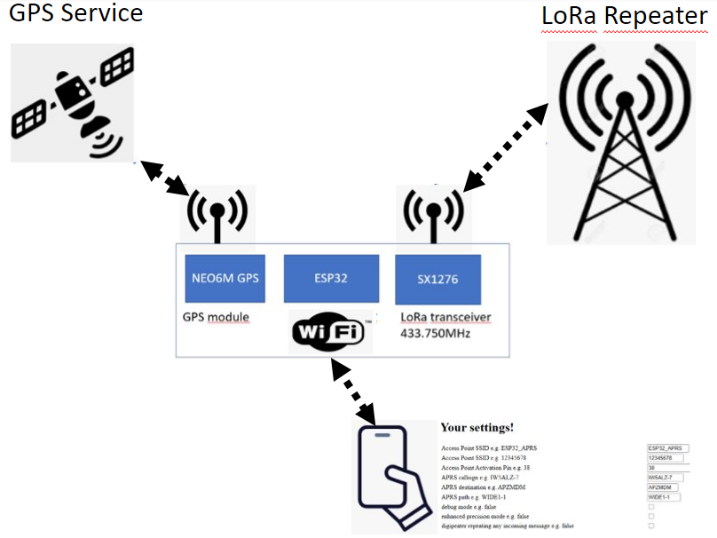

# Supported boards

You can use one of the Lora32 boards:

* TTGO T-Beam V0.7 (433MHz SX1278)
The original software is designed for it, also, but I never tried.

* TTGO T-Beam V1 (433MHz SX1278)
This boards cost around 35 Euros and includes a small 0.96" display
Keep in mind: you need a 433MHz version!

* Or you can build your own. See below

## LILYGO TTGO TBEAM
Front view
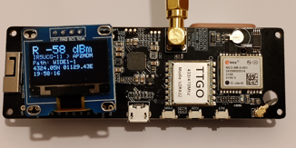

Rear view

Please note that I changed the GPS antenna with a most performing one.

The original antenna

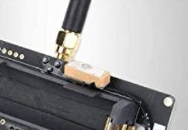

The most performing antenna

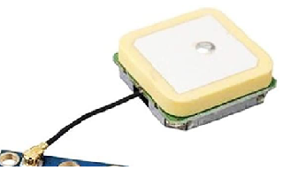

## ... or you can build your own board
<table>
  <tr>
    <td>
      
    </td>
    <td>
    
    </td>
  </tr>
</table>  
Please, note that here I'm sporting an amplified ["GPS magnetic antenna with a 3m cable"](https://www.amazon.it/gp/product/B01BML4XMQ/), very useful when the tracker is inside a vehicle.   
Yes, the TBEAM or the NEO6M breakboard supply the GPS amplifier with 3.3V! 

# Compiling and configuration

# How to compile

The best success is to use PlatformIO (and it is the only platform where I can support you). 

* Go to [PlatformIO](https://platformio.org/) download and install the IDE. 
* If installed open the IDE, go to the left side and click on 'extensions' then search for 'PatformIO' and install.
* When installed click 'the ant head' on the left and choose import the project on the right.
* Just open the folder and you can compile the Firmware.

# Configuration

* Press the service button (the middle one) for more than 5 seconds and a WiFi hotspot will be alive (SSID: ESP32_APRS)
* Connect to it with your smartphone or PC using the password 12345678
* After connection navigate to http://192.168.4.1 and the settings web page will show

# Settings
Be very careful when you change them!

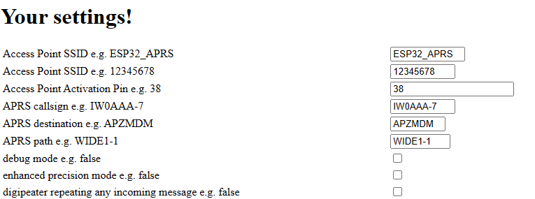

## Beacon modes
activate only one!!!
- I suggest to start with fixed_beacon (that don't use GPS and send the location set)
- Then try beacon (use GPS location). 
- Finally you can try smart_beacon in a moving vehicle. 

### Fixed beacon
* These are the settings for a beacon transmitting fixed coordinates (not using GPS) 
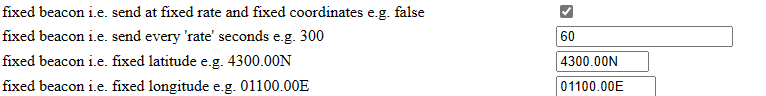

### Plain Beacon
* These are the settings for a beacon transmitting the GPS coordinates every 20 minutes
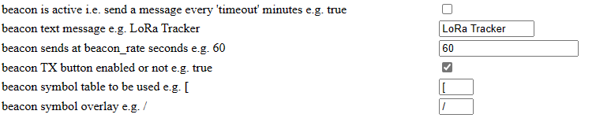

### Smart Beacon
* These are the settings for a beacon transmitting the GPS coordinates more frequently if the tracker moves at a higher speed 
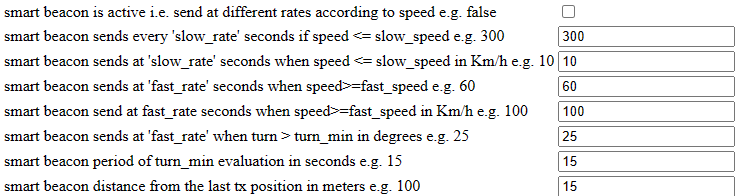

## PTT (Push To Talk)
* These are the settings for an external transmitter connected by its Push To Talk 
* Pleas note that you can save the settings or restore default settings
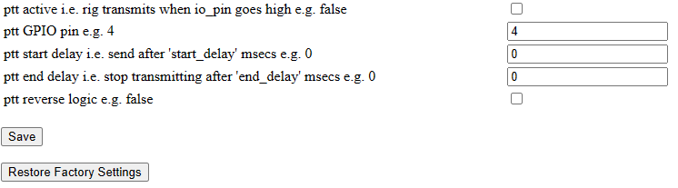
